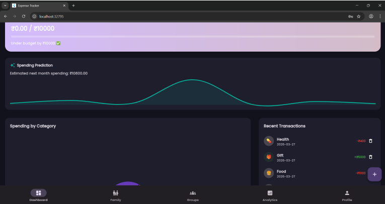
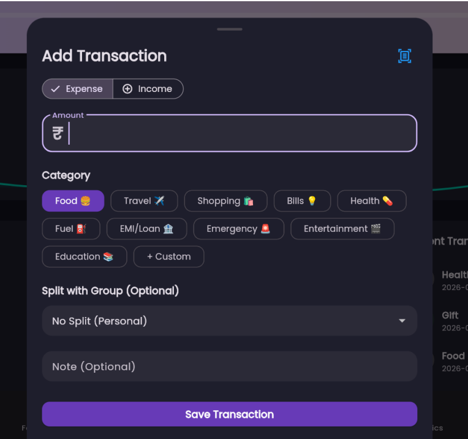

# Smart Expense Handler & Tracker

A cross-platform expense management application built with Flutter and Firebase, featuring AI-powered receipt scanning, collaborative expense splitting, budget tracking, and real-time synchronization.

## Overview

Most expense tracking applications either require extensive manual input or become cluttered with unnecessary features. Smart Expense Handler & Tracker was designed to simplify personal finance management through automation, collaboration, and intelligent expense categorization.

The application supports Android, iOS, and Web from a single Flutter codebase.

## Features

### AI-Powered Receipt Scanning

* Scan receipts directly using a mobile camera.
* Uses Google's Gemini API to extract expense information.
* Automatically categorizes expenses and pre-fills transaction details.
* Supports varied receipt formats without custom OCR templates.

### Collaborative Expense Splitting

* Create groups and track shared expenses.
* Automatic balance calculations using Firestore transactions.
* Debt simplification algorithm reduces the number of settlement transactions required between members.
* Real-time updates across all devices.

### Family Expense Management

* Dedicated family management module.
* Role-based administration.
* Relationship mapping between family members.
* Shared household expense tracking.

### Budget Management

* Category-specific and overall budgets.
* Daily, monthly, and yearly budget periods.
* Visual budget utilization indicators.
* Spending alerts and reminders.

### Analytics

* Monthly spending trend analysis.
* Category-wise spending breakdown.
* Linear regression-based spending forecasts.
* Interactive visualizations.

### Real-Time Synchronization

* Powered by Firebase Firestore.
* Changes are synchronized across devices within seconds.
* No manual refresh required.

---

## System Architecture

Presentation Layer
→ Flutter Widgets + go_router

State Management Layer
→ Riverpod Providers

Service Layer
→ FirestoreService
→ ReceiptService
→ MLService
→ NotificationService

Data Layer
→ Firebase Authentication
→ Cloud Firestore
→ Firebase Storage

---

## Tech Stack

### Frontend

* Flutter
* Dart
* Riverpod
* go_router

### Backend & Cloud

* Firebase Authentication
* Cloud Firestore
* Firebase Storage
* Firebase Cloud Messaging

### AI & Analytics

* Gemini API
* Linear Regression

### Notifications

* Firebase Cloud Messaging
* Local Notifications

---

## Key Engineering Decisions

### Firestore Transactions

Group balance updates are performed inside Firestore transactions to prevent race conditions when multiple users add expenses simultaneously.

### Debt Simplification Algorithm

A greedy settlement algorithm reduces repayment complexity and minimizes the number of transactions required between group members.

### Layered Architecture

The codebase follows a Presentation → State → Service → Data architecture to improve maintainability and separation of concerns.

---

## Results

* Cross-platform deployment across Android, iOS, and Web.
* Real-time synchronization latency of approximately 300–800 ms.
* Automated receipt parsing using Gemini multimodal capabilities.
* Collaborative expense management with transaction-safe balance tracking.

---

## Screenshots

Add screenshots here.

### Dashboard

### Expense Entry

---

## Documentation

Detailed project report available in:

`/docs/Smart_Expense_Handler_Report.pdf`

---

## Author

Tanay Aggarwal
